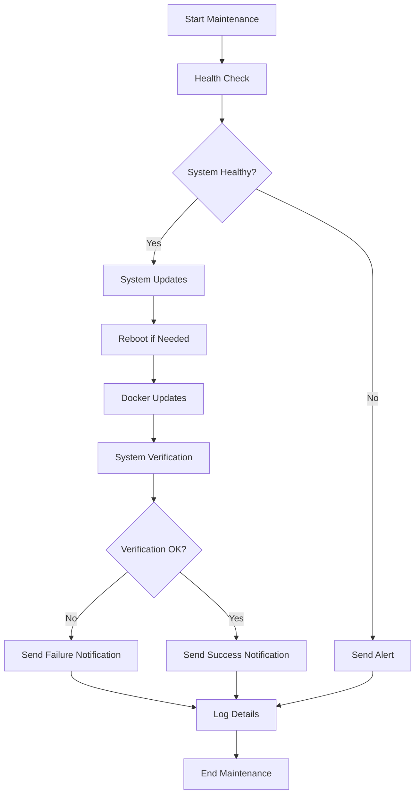

# LabOps


A comprehensive automation framework for managing and maintaining your home lab infrastructure. LabOps uses Ansible to automate system updates, Docker container management, health checks, and notifications.

## Overview

LabOps simplifies homelab maintenance by automating routine tasks and providing a consistent management interface across different operating systems. The framework follows a modular design with specialized tasks for system updates, container management, and monitoring.

**Key Benefits:**
- Reduce manual maintenance time
- Ensure consistent system updates
- Receive timely notifications about system status
- Maintain proper documentation of your infrastructure
- Track changes and maintenance history

## Features

- 🔄 **Automated System Updates**: Keep all systems up-to-date while handling reboots safely
- 🐳 **Docker Management**: Update containers and prune unused resources
- 🔍 **Health Monitoring**: Comprehensive checks for disk space, memory, load, and services
- 📧 **Notifications**: Email, webhook, and Telegram alerts for important events
- ✅ **Verification**: Post-update system verification ensures everything is working
- 🔌 **Multi-platform**: Support for Ubuntu, Synology, Windows, and macOS hosts

## Workflow

LabOps follows this maintenance workflow:



## Quick Start

```bash
# Clone the repository
git clone https://github.com/danjam/labops.git
cd labops

# Install required Ansible collections
ansible-galaxy collection install -r requirements.yml

# Configure your inventory
vi inventory/inventory.yml

# Make the script executable
chmod +x labops.sh

# Run the maintenance script
./labops.sh
```

## Project Structure

```
labops/
├── ansible.cfg                # Ansible configuration
├── labops.conf                # Configuration settings
├── labops.sh                  # Main execution script
├── README.md                  # Project documentation
│
├── docs/                      # Documentation directory
│   ├── installation.md        # Installation instructions
│   ├── notifications.md       # Notification setup guide
│   └── usage.md               # Usage examples and instructions
│
├── inventory/                 # Inventory structure
│   └── inventory.yml          # Main inventory file
│
├── logs/                      # Log directory
│   └── .gitkeep               # Placeholder to maintain directory
│
├── playbooks/                 # Ansible playbooks
│   └── homelab_maintenance.yml # Main maintenance playbook
│
└── tasks/                     # Task files
    ├── healthcheck.yml        # System health checks
    ├── send_notification.yml  # Notification system
    ├── update_docker.yml      # Docker container management
    ├── update_system_ubuntu.yml # Ubuntu system updates
    └── verify_system.yml      # Post-update verification
```

## Documentation

- [Installation Guide](docs/installation.md) - How to install and set up LabOps
- [Usage Guide](docs/usage.md) - How to use LabOps effectively
- [Notification Setup](docs/notifications.md) - Configure various notification methods

## System Requirements

- **Control Node**:
  - Ansible Core 2.12+
  - Python 3.8+
  - SSH access to managed systems
  
- **Managed Nodes**:
  - SSH server (Linux/macOS) or WinRM (Windows)
  - Python 3.6+ (auto-detected)
  - Sudo/root access for system operations
  
- **Optional Components**:
  - Docker & Docker Compose v2 (for container management)
  - SMTP server access (for email notifications)
  - Telegram Bot API access (for Telegram notifications)
  - Webhook endpoint (for webhook notifications)

## Command-Line Options

```bash
Usage: ./labops.sh [options]

Options:
  -i, --inventory INVENTORY  Specify inventory file
                             (default: inventory/inventory.yml)
  -p, --playbook PLAYBOOK    Specify playbook file
                             (default: playbooks/homelab_maintenance.yml)
  -t, --tags TAGS            Specify tags (e.g., system,docker)
  -v, --verbose              Increase verbosity (-v, -vv, or -vvv)
  -S, --no-password          Don't ask for passwords (use SSH keys)
  -l, --limit HOSTS          Limit execution to specified hosts
  -c, --check                Run in check mode (dry run)
  --list-hosts               List all hosts in the inventory
  --version                  Show version information
  -h, --help                 Show this help message
```

## Key Features

### System Health Checks

LabOps performs comprehensive health checks on all systems, including:

- Disk space monitoring (warns at 85% usage)
- Memory usage monitoring (warns at 90% usage)
- System load analysis
- Process monitoring
- Available updates detection

### System Updates

For Ubuntu systems, LabOps:

- Safely updates all packages
- Handles package dependencies
- Manages kernel updates with controlled reboots
- Reports update statistics
- Verifies system health after updates

### Docker Management

The Docker management module:

- Updates container images
- Restarts containers with new images
- Health-checks containers after updates
- Prunes unused resources
- Reports container status

### Notification System

LabOps includes a flexible notification system supporting:

- Email notifications via SMTP
- Webhook notifications (for services like Slack, Discord)
- Telegram notifications

## Common Usage Examples

```bash
# Run full maintenance on all systems
./labops.sh

# Only perform health checks
./labops.sh --tags healthcheck

# Update only Ubuntu systems
./labops.sh --limit ubuntu --tags system

# Update Docker containers on storage servers
./labops.sh --limit storage --tags docker

# Perform a dry run to see what would change
./labops.sh --check
```

## Customization

LabOps can be customized in several ways:

- **Configuration File**: Edit `labops.conf` to customize default behavior
- **Inventory Groups**: Organize hosts in `inventory/inventory.yml` based on function or OS
- **Task Variables**: Adjust task parameters in playbooks or inventory variables
- **Notification Templates**: Customize notification formats in `send_notification.yml`

For detailed customization options, see the [Installation Guide](docs/installation.md).

## License

This project is licensed under the MIT License - see the [LICENSE](LICENSE) file for details.

## Support

If you find this project useful, please consider giving it a star on GitHub!